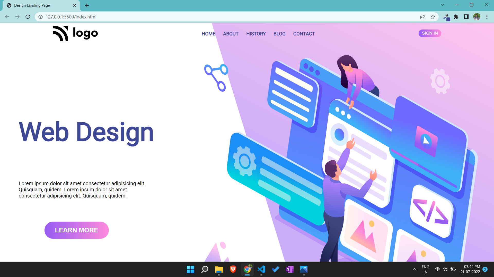

# Portfolio project 8

This is a one page portfolio template project made in HTML and CSS.

# Project live link

[Portfolio-project-8](https://neon-crisp-30efa1.netlify.app)

# Screenshot

# My learnings from this projects

- I learned to make layouts using flex box.
- I learned more about position property in CSS.

# Time to finish the projecet

I took about 4.5 hours approximately to complete this project.
